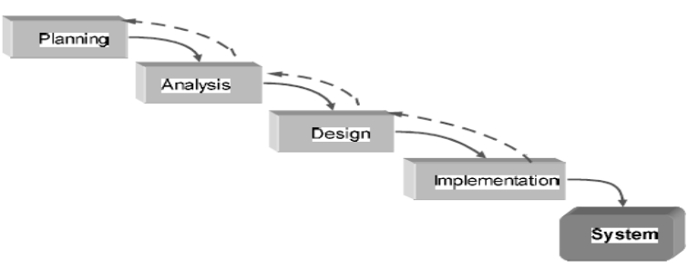
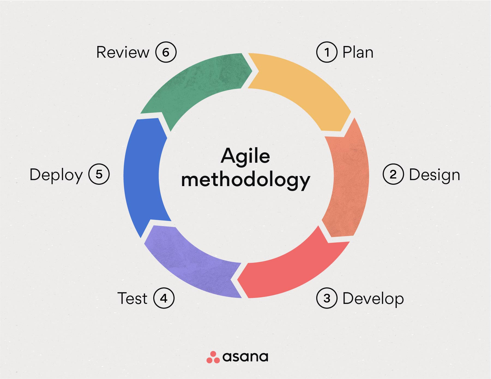

# TUGAS Kamis 18 / 07 / 2024

# Disusun Oleh

| NAMA 
| ---- 
| [Adam Rasyid Nurmuhammad](https://github.com/adamrasyid01)| 

**DAFTAR ISI**

1. [Pengertian SDLC secara Umum](#1-pengertian)
2. [Macam Metodologi Pengembangan Perangkat Lunak](#2-macam-macam-metodologi-pengembangan-perangkat-lunak)
3. [Perbedaan SDLC](#3-perbedaan-sdlc)
4. [Penerapan yang Bagus](#4-penerapan-yang-bagus)

(pengertian, methode, difference, penerapan yang bagus, kesimpulan)

# 1. Pengertian SDLC secara Umum

* Metodologi Pengembangan Perangkat Lunak dapat 
diartikan sebagai proses membuat suatu perangkat lunak 
baru untuk menggantikan perangkat lunak lama secara 
keseluruhan atau memperbaiki perangkat lunak yang telah 
ada 

# 2. Macam-macam Metodologi Pengembangan Perangkat Lunak

### 2.1 Linear Sequential Model

Sering disebut metode Waterfall adalah metode pengembangan perangkat lunak dengan pendekatan sekuensial 
Planning

* Planning
  
  Pembentukan kebutuhan-kebutuhan untuk seluruh 
  elemen sistem dan kemudian memilah mana yang 
  untuk pengembangan perangkat lunak

* Analysis

  Pengumpulan kebutuhan yang diperlukan Perangkat Lunak yang hasilnya harus didokumentasi dan di-review ke pelanggan.

* Design

  Mengubah kebutuhan-kebutuhan menjadi 
  bentuk karakteristik sebelum memulai menuliskan program

* Implementation

  Menerjemahkan desain dengan menggunakan bahasa pemrograman

* Testing

  Pengujian logika internal dari perangkat lunak, mencari kemungkinan kesalahan dan mencocokkan dengan hasil yang diinginkan.

* Maintenance

  i). Corrective Maintenance -> Pemeliharaan yang terkait  terdeteksi saat perangkat lunak digunakan 

  ii). Adaptive Maintenance -> Pemeliharaan sistem karena ada  update sistem operasi

  iii). Perfektive Maintenance -> Tambah kemampuan ketika sukses dipakai oleh pemakai

### 2.2 Parallel Model

Metodologi ini tujuannya mengatasi interval waktu yang lama 
antara tahap analisis dan pengiriman sistem.
Proyek dibagi menjadi serangkaian subproyek yang berbeda dan dilaksanakan secara paralel, setelah subproyek sempurna dilakukan integrasi sehingga dilakukan delivery 

### 2.3 Iterative Model

Pengembangan dilakukan secara berulang (iterasi). per iterasi menghasilkan peningkatan perangkat lunak.

Model diimplementasi dengan perulangan, sehingga proyek dibagi menjadi bagian bagian kecil. Ini membuat tim pengembangan dapat menunjukkan hasil sebelumnya dan mendapatkan feedback  dari pengguna 

### 2.4 Prototyping Model

Metode yang mengijinkan user memiliki gambaran awal tentang progam yang akan dikembangkan serta melakukan pengujian awal.

Evaluasi ini dilakukan oleh pelanggan , jika sudah sesuai maka langkah selanjutnya akan diambil . Namun jika belum sesuai maka prototyping nya direvisi dengan mengulang langkah-langkah sebelumnya.

### 2.5 Throwaway Prototyping Model

Prototipe dibuat dengan cepat untuk memahami dan mengklarifikasi kebutuhan pengguna, tetapi tidak bermaksud untuk jadi bagian dari sistem akhir.
Tujuan Mengumpulkan kebutuhan dan mendapatkan umpan balik pengguna untuk memperjelas persyaratan sistem.

Evaluasi pelanggan untuk merancang sistem akhir

### 2.6 RAD (Rapid Applicatioon Development) Model

Metode berfokus pada pembuatan prototype secara cepat dan mengandalkan feedback dari user.

Untungnya adalah jangka waktu pengembangan jadi cepat, karena feedback dari pelanggan cepat didapatkan dan semua perubahan akan disesuaikan dengan hasil tersebut. Tapi developer harus punya skill tinggi

### 2.7 Spiral Model

Memadukan model prototyping dan sistematika dari linear sequential model. Spiral Model ini telah didukung dengan penanganan risiko.
cocok untuk proyek besar yang punya risiko menengah hingga tinggi.

Tahapan Spiral model antara lain: 

* a) Perencanaan (Planning).

* b) Analisis resiko (Risk Analysis).

* c) Rekayasa (Engineering). 

* d) Evaluasi Pemakai (Customer Evaluation).

### 2.8 V-Shaped Model

Model ini seperti air terjun dimana tiap fase harus diselesaikan sebelum tahap berikutnya. Sebelum pengembangan dimulai, rencana uji sistem dibuat. Rencana berfokus pada pemenuhan fungsi yang ditetapkan dalam persyaratan pengumpulan.

### 2.9 Agile Development Model

Model berfokus pada perampingan SDLC dengan menghilangkan banyak pemodelan dan dokumentasi overhead. Proyek menekankan pengembangan aplikasi secara berulang.

Agile Development berasal dari Agile Manifesto yang dikembangkan 14 tokoh penting terkenal yang berperan dalam dunia industri perangkat lunak.

# 3. Perbedaan SDLC

# 4. Penerapan yang bagus

Tidak ada metodologi yang benar-benar sesuai dengan 
semua jenis organsasi, sehingga diperlukan pendekatan 
lebih lanjut untuk memilih metodologi mana yang paling 
sesuai untuk dapat diterapkan pada organisasi tertentu

Menurut Beberapa pendapat tentang pemilihan metodologi 
pengembangan sistem dari beberapa hasil literatur jurnal antara lain:

Menurut Munassar, Umumnya menggunakan model 
waterfall dan spiral yang dibangun pada tahun 1970 dan 
tahun 1999.

Menurut Ajah, memilih metodologi berdasarkan

* 1. Kejelasan kebutuhan pengguna

* 2. Penguasaan teknologi

* 3. Tingkat kerumitan sistem 

* 4. Tingkat kehandalan sistem 

* 5. Waktu pelaksanaan dan visibilitas jadwal pelaksanaan 
